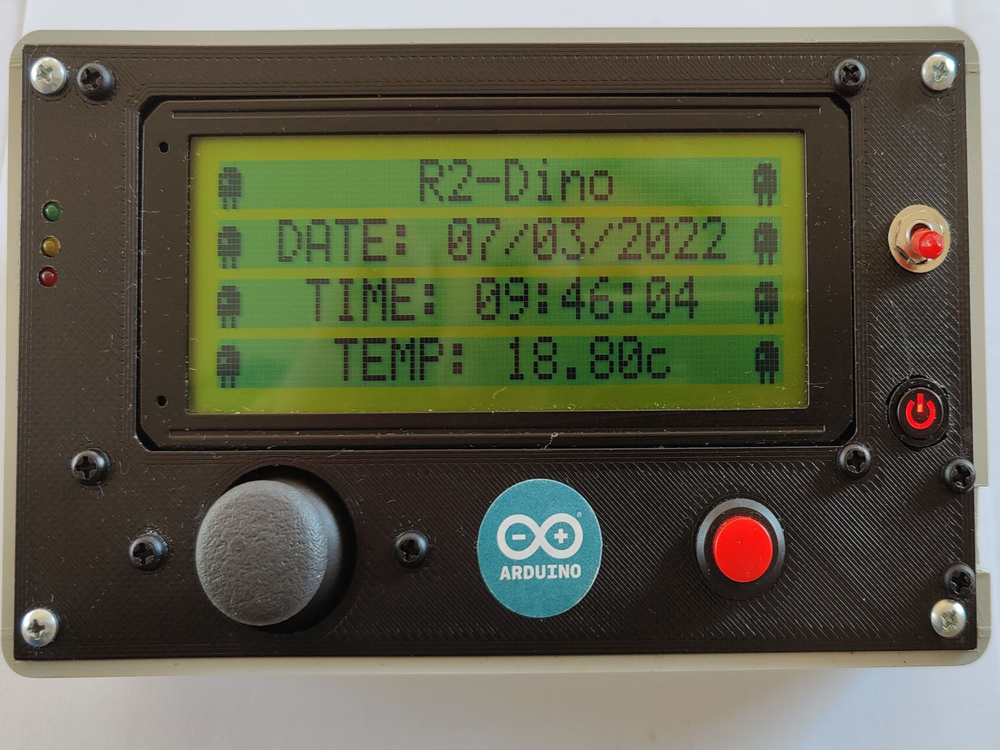

# R2Dino
### Alarm clock, temperature reading and an old school arcade game made with Arduino Uno

#### Story
This is my first Arduino project and c++ programming. I had an old serial 4x20 LCD display and I wanted to use it somehow along with an Arduino Student kit i bought. I decided to create an alarm clock with the help of DS1307 RTC clock which will also display room temperature with the help of an LM35 sensor. I decided also to add a little fun with a mini arcade game based on on the classic Space Invaders.

### Hardware description

#### Joystick
Joystick's X-axis output is connected to A0 and Y-axis to A1. Both lines have a 1K resistor to ground in order to have the output voltage close to internal 1.1V reference. The joystick is used to control r2d2 in the arcade game as long as selecting actions in the different menus

#### LM35
LM35's output is connected to A2. I've also set the analog reference to internal. This will provide better temperature resolution.

#### DS1307
This RTC module is communicating via an I2C connection with Arduino. The default I2C implementation uses A4 for SDA and A4 for SCL.

#### Buzzer
Buzzer is connected directly to D10 and uses its PWM output capabilities.

#### Fire button
Is a standard tact switch connected to D3. D3 is used to make r2d2 fire its laser and also select a highlighted menu entry.

#### LCD
I used the SoftwareSerial library to connect the LCD with the Arduino. Using Arduino's default TX/RX pins (D0, D1) was corrupting the lcd during program upload. By using different pins for its communication I resolved this. I only use D12 to transmit serial data to the LCD.

The LCD has a backlight input. I control this input with the help of a PNP transistor. The BC557's base is connected to D13 via an 1K resistor. When D13 is LOW then the backlight is powered, when it's HIGH backlight is off. This helps to reduce power consumption by turning it off after 30secs of inactivity.

#### Extra hardware used
The following hardware is not essential to the project but I decided to use them when I was looking for an autonomous result with its own enclosure.

The project is powered by a Li-Ion 3.7v battery. The battery is connected to power boost board giving the desired 5V output. This specific power boost board has also a charger which is used to charge the battery when it's connected to a usb.

A USB-C breakout board is used for input of power and communicating with the ps. I connected the data lines of the USB-C to a male USB Type B plug. The input power is connected to the charger and the boost's output is connected to the USB Type B. This gives the advantage of charging the battery while the project is connected to the pc for programming and testing.

The power boost board has an _Enable_ pin which when pulled to ground it's output is turned off. I connected a rocker switch to this _Enable_ pin serving as a on/off.

Arduino's _Reset_ pin is connected to an illuminated push button which also serves as a power-on indicator. I believe _Reset_ is useful to be accessible when your project is in enclosure, especially when you are testing and programming

The battery charger has three on-board leds which indicate battery-low, charging, and charged states. In their place I connected a "traffic light" led component. This has a green, a yellow and a red led nicely packed together and are visible at the front of the enclosure.

